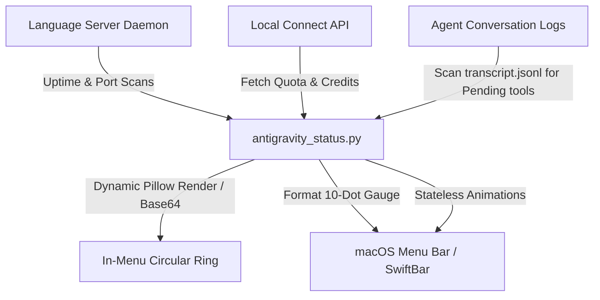
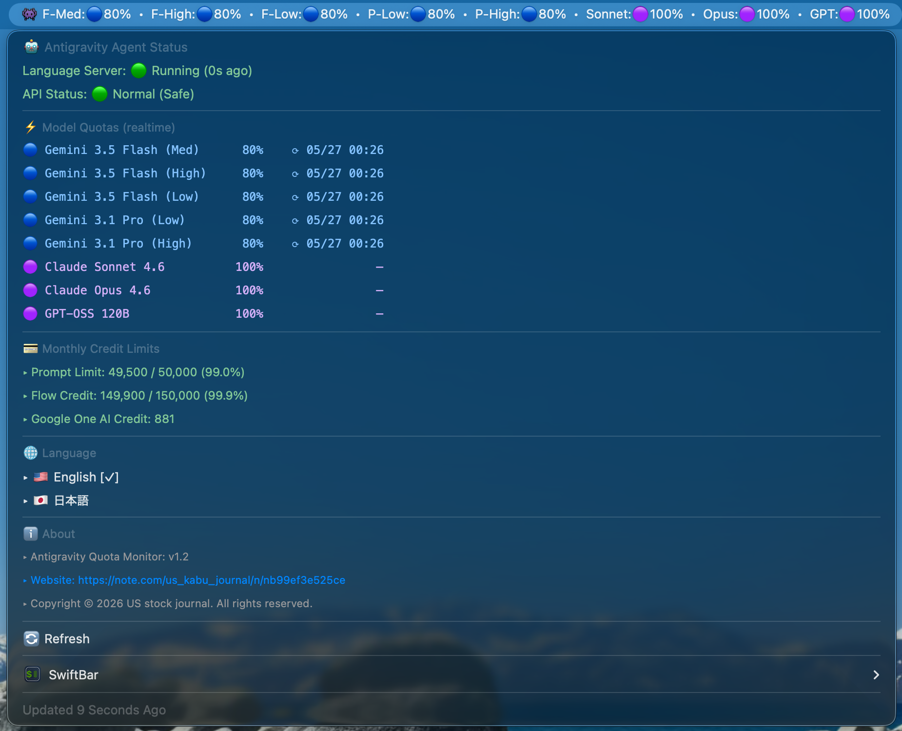
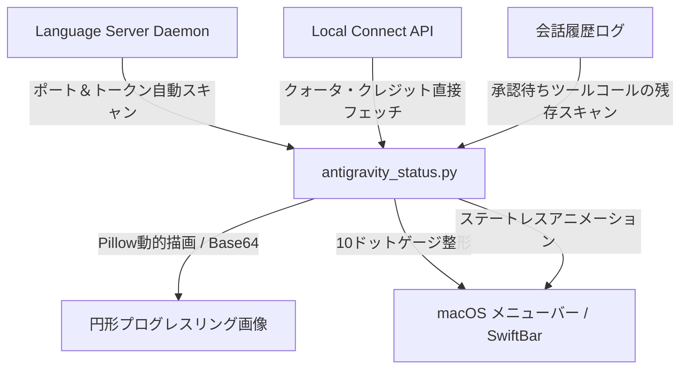

# 👾 Antigravity Quota Monitor (AQM)

🇯🇵 **[日本語バージョンはこちら (Jump to Japanese Version)](#-日本語バージョン)**

---

**Antigravity Quota Monitor (AQM)** is a premium macOS menu bar utility (SwiftBar / xbar plugin) designed to monitor real-time API quotas, reset times, and monthly credits for your LLMs under the Antigravity agent system.

Starting with **v2.7.0**, AQM has been completely redesigned with an ultra-sleek **10-Dot System Bar Gauge** and **Dynamic In-Menu Progress Rings** to offer a premium, space-saving desktop dashboard experience.

---

## ✨ Features (v2.7.0)

*   **🟢 10-Dot System Bar Gauge (New)**: Replaced verbose textual status items on your menu bar with a beautiful, space-efficient horizontal 10-dot gauge (`🔴🟢🔵🟣🟡🟠`). You can grasp your exact quota level (in 10% steps) at a single glance.
*   **🍩 Dynamic In-Menu Progress Rings (New)**: Detailed dropdown now generates high-definition circular progress rings dynamically on-the-fly using `Pillow`. 
*   **🛡️ Non-Disruptive Text Fallback (New)**: Zero dependencies by default. If `Pillow` is not installed on the system, the script seamlessly falls back to beautiful text-based block indicators (`████░░`) to guarantee zero-crash execution.
*   **⚠️ Advanced Agent State Sync (New)**: Fixed state synchronization. The menu bar icon dynamically animates to reflect the AI agent's current state: Thinking (✨🤔), Awaiting Your Input/Approval (⚠️ Pending!), Idle (👾), or Offline (⚪️). It now precisely tracks tool approvals (e.g., `run_command`, `write_to_file`) to show warning states instantly.
*   **💳 Clean Credit Tracker**: Automatically consolidates credit logs to show remaining `Google One AI Credits` clearly, omitting redundant details to maximize readability.
*   **⏱️ Localized Reset Times**: Detects the precise UTC reset times from local APIs and automatically translates them into your local timezone (e.g. `JST`). Displays `-` when quota is fully available (100%) to reduce noise.
*   **🌐 In-Menu Translation (EN / JA)**: Toggle display languages between English and Japanese with a single click in the menu dropdown.
*   **🐍 Pure Python / Zero External Dependencies**: The entire daemon runs on Python standard library only. **No Node.js, no npm, no external runtimes required.**

---

## 🏗️ Technical Architecture

AQM uses a light-weight, asynchronous pipeline designed for zero-configuration, zero-dependency, and extremely low system load.

---

## 🔴 Quota Status System

AQM represents remaining quotas using a premium color-coded system.

| Status | Dot Color | Percentage Range | Visual Representation & Meaning |
| :---: | :--- | :---: | :--- |
| 🟣 | **Purple** | `100%` | **Full capacity** — Completely safe and ready to generate content. |
| 🔵 | **Blue** | `80% - 99%` | **Highly stable** — Securely active with plenty of quota remaining. |
| 🟢 | **Green** | `60% - 79%` | **Safe state** — Normal operation mode with stable capacity. |
| 🟡 | **Yellow** | `40% - 59%` | **Caution mode** — Approaching limits. Displays the reset timer (e.g., `⟳ JST 15:16`). |
| 🟠 | **Orange** | `20% - 39%` | **Low capacity** — Quota running thin. Recovery timer displayed. |
| 🔴 | **Red** | `0% - 19%` | **Exhausted** — Crucial recovery state. Reset time is highlighted. |

---

## 🧠 Agent State Indicator

The leftmost icon in the menu bar dynamically reflects your AI agent's real-time operational state:

| State | Animation | Description |
| :---: | :--- | :--- |
| **Thinking** | ✨️🤔 → 💫🤔 → ⭐🤔 → 🌟😃 | Agent is actively generating, analyzing, or executing tasks. |
| **Pending** | ⚠️ Pending! (Awaiting Approval) | Agent is waiting for your permission or input (e.g. `run_command`, `write_to_file`). |
| **Idle** | 👾 | Agent is standing by. No active tasks. |
| **Offline** | ⚪️ | Language Server is not running. |

---

## 🚀 Installation & Setup

### 1. Install via VS Code Extension (Recommended)

1. Open the **Extensions Panel** in your IDE (VS Code, Cursor, etc.).
2. Search for **`AQM`** or `Antigravity Quota`.
3. Install **Antigravity Quota Monitor** published by **ma-do-ka**.

* 📦 *Open VSX: [ma-do-ka/antigravity-quota](https://open-vsx.org/extension/ma-do-ka/antigravity-quota)*
* 💻 *GitHub: [ma-do-ka/Antigravity-Quota-Monitor](https://github.com/ma-do-ka/Antigravity-Quota-Monitor)*

> [!NOTE]
> Installing this extension automatically deploys the latest SwiftBar plugin scripts to your macOS environment in the background.

### 2. Prepare SwiftBar (macOS)

1. Download and install **SwiftBar** from the [SwiftBar Official GitHub](https://github.com/swiftbar/SwiftBar) (or run `brew install swiftbar` via Homebrew).
2. Launch SwiftBar. It will automatically detect the AQM script and load it.

---

## 🛡️ Privacy & Security

*   **100% Local Communications**: All API queries travel strictly over `127.0.0.1` (localhost). Your credentials never touch any public servers or third-party metrics platforms.
*   **Dynamic Session Binding**: AQM retrieves temporary authorization tokens from local running daemons. No plaintext API keys are ever stored on disk.

---

## 📋 Changelog

### v2.7.0
- 🔴 **Comprehensive Resource & Stability Optimization**:
  - **Process Timeout**: Added a 5-second timeout to the `ps` subprocess check inside `find_lsp_info` to completely prevent process accumulation or daemon freezing if system queries hang.
  - **Atomic File Lock**: Refactored the background fetch execution lock using standard POSIX `O_CREAT | O_EXCL` flags, resolving a potential TOCTOU race condition when launching concurrent processes.
  - **Memory & File Descriptor Leak Prevention**: Upgraded stderr redirection to append mode (`"a"`) with a 1MB file size limit to prevent memory/FD exhaustion during long-term desktop execution.
  - **Memory Image Caching**: Introduced a dynamic Pillow circular progress base64 image cache (`_IMAGE_CACHE`, max 10 entries) to eliminate redundant PNG generation/base64 encoding and completely eliminate 10s idle CPU spikes.
  - **I/O & Memory Reductions**: Disabled active stdout/stderr file dumps by default (now requires `AGQ_DEBUG=1` environment variable). Resolved double `split('\n')` calls in log scanning to lower memory consumption.
  - **Code Cleanup**: Removed duplicate definitions of the daemon directories and aligned cache updates natively inside the lookup scope.

### v2.6.1
- ⚙️ **Rollback Quota Estimation (Correctness Focus)**: Completely rolled back the local caching algorithm that separately estimated 5h and Weekly quotas. Now directly displays raw API values for Gemini and Claude/GPT models with their actual reset type suffix (`[5h]` or `[Weekly]`). Added safety cache-clearing logic to automatically reset invalid v2.6.0 keys to fallback defaults.

### v2.6.0
- ⚡ **Shifting Back to 10s Cycle for CPU Optimization**: To prevent the macOS `WindowServer` and CPU usage spikes (up to 18%+) caused by process accumulation in previous releases, we have shifted the plugin refresh interval back to **10 seconds** (`antigravity_status.10s.py`). This reduces CPU usage to a safe range of 3-4% (approx. 80% reduction).
- ✨ **Separate 5h and Weekly Quota Caches (Multi-Quota Display)**: Designed an intelligent local caching algorithm to separately track and display both the **5-Hour (5h)** and **Weekly** quotas for Gemini and Claude/GPT models in the dropdown menu. This solves the API limitation where only the single most restrictive percentage was visible.

### v2.4.0
- 🔒 **Background Double-Lock Prevention**: Added an active timeout-based lock file (`fetch.lock` with a 30s TTL) to prevent background API fetch forks (`--fetch-bg`) from spawning redundantly, resolving potential process accumulation.
- 🎨 **Memory Font Caching**: Introduced a global font cache (`_FONT_CACHE`) in Pillow image rendering to eliminate TrueType file loading disk reads during dynamic Base64 icon generation.
- 🧹 **User-Space Logging & Sandboxing**: Moved `/tmp/agq_error.log` and `/tmp/agq_crash.log` to user-specific directories (`~/.gemini/antigravity/daemon/`) to completely prevent `PermissionError` and resource conflicts in multi-user environments.
- 🌍 **Dynamic User Log Resolution**: Replaced the hardcoded `/Users/user/` active log path with `os.path.expanduser` to support arbitrary macOS usernames and environments out-of-the-box.

### v2.3.0
- ⚡ **Extreme IO & Performance Optimization (A/B/C Fixes)**: Restricted directory scanning in `get_stateless_log_status` and `check_pending_approval` to the top 5 latest active session folders, reducing disk I/O cost to a constant `O(1)`. Shrank `transcript.jsonl` parse buffer from 1MB to 50KB to minimize JSON deserialization CPU spikes.
- ⚙️ **Multi-Workspace Pending Sync**: Extended the Pending approval check to scan multiple active session folders concurrently, resolving issues where pending states in other windows were hidden by active log updates.
- 🧹 **Automatic Plugin Cleanup**: Implemented `deactivate()` to clean up and delete `antigravity_status.2s.py` automatically from the SwiftBar directory when the extension is disabled or uninstalled, preventing background zombie execution.

### v2.2.0
- ⚡ **Perfect WindowServer Crash Prevention & 2s Cycle Restoration**: Removed image generation from the menu bar title line to completely eliminate CoreAnimation and window manager memory/Mach-port leaks during idle monitoring. This allows us to safely restore the fast **2-second refresh rate** (`antigravity_status.2s.py`) to show agent states like Thinking or Pending instantly without causing system instability.

### v2.1.0
- ⚡ **Resource Optimization for Stability (Preventing WindowServer Crash)**: Reduced the plugin refresh interval from 2 seconds to 10 seconds (`antigravity_status.10s.py`). This major change prevents macOS `WindowServer` from resource exhaustion (Mach port leakage/excess) caused by high-frequency process execution and CoreAnimation transaction updates, ensuring absolute system-wide stability.

### v2.0.5
- 🐛 **Fix Pending State Awaiting Approval**: Resolved an issue where the status bar would display `Thinking` instead of `Pending` when a user confirmation dialog (e.g. `Allow running this command?`) was active. The parser now correctly detects and processes `BLOCKED`, `PENDING`, and `WAITING` statuses in logs without incorrectly marking them as executed.

### v2.0.4
- ⚙️ **Enhanced Agent State Sync (Working Status)**: AQM now tracks the last modification time (`mtime`) and content of the conversation logs (`transcript.jsonl`). If the conversation was updated recently (within 120 seconds) and the model hasn't returned a final reply, the status bar correctly displays `Thinking` (Active), even if the language server is temporarily offline or idle during autonomous file editing or exploration.

### v2.0.3
- 🐛 **Fix False Positive Awaiting Approval (Pending)**: Resolved a bug where the menu bar icon stayed in the `Pending` state even when no tool approvals were active. The check now properly terminates upon reaching the latest response, eliminating incorrect evaluation of older logs.

### v2.0.2
- 🐛 **Agent State Detection Logic Fix**: Fixed an issue where the status bar icon would display as "Stopped" (⚪️) even when a task was active ("Working") if the LSP process was offline or undetected. The display now correctly prioritizes active command and pending statuses.

### v2.0.1
- 🚀 **Automated Publishing via GitHub Actions**: Directly publish compiled packages to Open VSX Registry and VS Code Marketplace upon pushing to `main` (if secrets are set).
- ⚙️ **Modernized CI Workflow**: Upgraded deprecated GitHub Actions syntax.

### v2.0.0
- ✨ **10-Dot System Bar Gauge**: Clean, space-saving dot indicator array replacing verbose textual titles.
- ✨ **Pillow Dynamic Ring Drawing**: Generates high-definition circular progress rings inside the dropdown.
- ✨ **Robust Text-based Fallback**: Seamlessly falls back to `████░░` if Pillow is missing.
- 🐛 **Advanced Tool Approval Sync**: Fixed a state-tracking bug where user Proceed approvals for tools (`run_command` / file edits) were not reflected in the status icon.

### v1.7.0
- 🚀 Bulletproof scan-and-clean to prevent duplicate icons upon version updates.
- 🐛 Fixed permanent "Awaiting Input" state hanging.

### v1.5.0
- 🚀 Pure Python Migration. Removed Node.js (`get_quota.js`) dependency.

---

# 🇯🇵 日本語バージョン

**Antigravity Quota Monitor (AQM)** は、macOS のメニューバー（システムバー）および VS Code に、Antigravity（Gemini）エージェント環境下の利用クォータ残量、リセット時間、およびクレジット制限枠を**美しく可視化するプレミアムユーティリティ**です。

最新バージョンである **v2.7.0** では、デスクトップ領域を邪魔しない**10ドット・システムバーゲージ**と、詳細メニュー内の**動的プログレスリング画像表示**を新たに搭載し、圧倒的にスマートなUIへ進化しました。

---

## ✨ v2.7.0 の新機能と特長

*   **🟢 10ドット・システムバーゲージ (New)**: メニューバー上の長ったらしい文字列表示を廃止し、省スペースで直感的な10個のカラードット（`🔴🟢🔵🟣🟡🟠`）によるゲージ表示に変更。残りクォータを10%刻みで直感的に把握できます。
*   **🍩 動的プログレスリング画像表示 (New)**: 詳細ドロップダウン内に、`Pillow` ライブラリを用いてその場で高解像度な円形進捗リング画像を動的に生成して表示します。
*   **🛡️ 依存ゼロの自動テキストフォールバック (New)**: 万が一システムに `Pillow` がインストールされていない環境であっても、プログラムがクラッシュすることなく自動的にテキストブロックバー（`████░░`）へ安全に切り替える堅牢なフォールバック設計を導入。
*   **⚠️ 高度な承認待ち状態の検知 (New)**: ユーザーの承認（Proceed）を待つコマンド実行（`run_command`）やファイル書き込み（`write_to_file` / `replace_file_content`）のログ状態をリアルタイムにスキャン。確認待ち状態を正確に捉え、メニューバー上に `⚠️ Pending!`（待機中）アイコンをアニメーション表示します。
*   **💳 クレジット表示のシンプル化**: 重複するプロンプト/フロークレジット制限表示を整理し、`Google One AI Credit` に統合されたスマートな表示レイアウトに変更。
*   **⏱️ 回復時間の日本時間自動変換**: APIが返すUTC時間のリセットタイミングを自動的に日本時間（JST）へ変換。残量が 100% 満タンの際は回復時間を `-` と表示し、無駄な表示ノイズを極限まで排除。
*   **🌐 日英ワンクリック切り替え**: ドロップダウンメニュー内から、英語表示と日本語表示をワンクリックで瞬時に切り替え可能。
*   **🐍 Pure Python / 外部依存なし**: バックエンド全体が Python 標準ライブラリ（`urllib`）のみで動作。Node.js や npm 等のインストールは一切必要ありません。

---

## 🏗️ 技術アーキテクチャ

AQM は、ローカル環境への負荷と外部依存をゼロに抑えるために、完全な Pure Python 非同期パイプラインで構築されています。

---

## 🔴 クォータ表示ステータス一覧

メニューバー上の各モデルの残りクォータは、プレミアムな6色のカラーコードシステムによって視覚的に美しく分類されます。

| 状態 | ドット色 | パーセント閾値 | 視覚表現とステータスの意味 |
| :---: | :--- | :---: | :--- |
| 🟣 | **紫 (Purple)** | `100%` | **満タン稼働中** — クォータは完全に安全で、すぐにフル生成が可能です。 |
| 🔵 | **青 (Blue)** | `80% - 99%` | **極めて安定** — 十分な容量を維持して安全に稼働中。 |
| 🟢 | **緑 (Green)** | `60% - 79%` | **通常動作状態** — 安定した残量があり、平常通り生成可能です。 |
| 🟡 | **黄 (Yellow)** | `40% - 59%` | **注意モード** — 残量がやや低下。回復時間が動的に表示されます（例: `⟳ JST 15:16`）。 |
| 🟠 | **橙 (Orange)** | `20% - 39%` | **残量僅少** — 回復時間（日本時間 JST）を表示。生成を抑えて回復を待つことを推奨。 |
| 🔴 | **赤 (Red)** | `0% - 19%` | **制限・枯渇** — API制限回復待ち。回復タイムスタンプを表示。 |

---

## 🧠 エージェント状態インジケーター

メニューバー左端のアイコンが、AIエージェントのリアルタイムな動作状態に応じてアニメーションで動的に変化します：

| 状態 | アニメーション | 説明 |
| :---: | :--- | :--- |
| **思考中** | ✨️🤔 → 💫🤔 → ⭐🤔 → 🌟😃 | エージェントがコード生成・分析・タスク実行中 |
| **承認待ち** | ⚠️ Pending! (承認・入力待ち) | `run_command` や `write_to_file` 等の実行許可ダイアログが表示され、ユーザーの入力を待機している状態 |
| **待機中** | 👾 | アイドル状態。アクティブなタスクなし |
| **オフライン** | ⚪️ | Language Server が停止中 |

---

## 🚀 導入・セットアップ手順

### 1. VS Code 拡張機能のインストール（推奨）

1. お使いのIDE（VS Code, Cursorなど）の **拡張機能パネル**（Extensions）を開きます。
2. 検索バーに **`AQM`** または `Antigravity Quota` と入力します。
3. **ma-do-ka** がパブリッシュしている **Antigravity Quota Monitor (AQM)** をインストールします。

* 📦 *Open VSX 公式: [ma-do-ka/antigravity-quota](https://open-vsx.org/extension/ma-do-ka/antigravity-quota)*
* 💻 *GitHub: [ma-do-ka/Antigravity-Quota-Monitor](https://github.com/ma-do-ka/Antigravity-Quota-Monitor)*

> [!NOTE]
> 拡張機能がインストールされると、バックグラウンドで自動的に最新の SwiftBar プラグインスクリプトが macOS の適切な場所に配置されます。

### 2. SwiftBar の準備 (macOS)

1. [SwiftBar 公式 GitHub](https://github.com/swiftbar/SwiftBar) からアプリをダウンロードしてインストールします（Homebrew ユーザーは `brew install swiftbar` でも可）。
2. SwiftBar を起動します。自動的に AQM プラグインが読み込まれ、メニューバーに表示が開始されます。

---

## 🛡️ プライバシーとセキュリティ

*   **完全ローカル通信**: APIクエリを含むすべての通信はローカルホスト（`127.0.0.1`）でのみ完結します。クォータ情報や認証トークンが外部サーバーへ送信されることは一切ありません。
*   **セッショントークンの動的ロード**: 起動中の LSP プロセスから一時的なトークンを動的に取得するため、APIキー等の秘密情報をハードコードして保存するリスクがありません。

---

## 📋 更新履歴 (Changelog)

### v2.7.0
- 🔴 **包括的なリソース＆安定性最適化 (8件の重大改修)**:
  - **サブプロセスのタイムアウト設定**: `find_lsp_info` 内のプロセス取得コマンドに `timeout=5` 秒を設定し、LSPの死活監視ハングアップ時のプロセス無限蓄積リスクを完全排除。
  - **アトミックロックの導入**: バックグラウンドフェッチ用排他制御ファイル（ロック）の取得に POSIX 標準の `O_CREAT | O_EXCL` フラグを採用し、TOCTOU レースコンディション（二重起動）を完全防止。
  - **ファイルディスクリプタリークおよびログ肥大化防止**: stderr ログ書き込みハンドルを追記（`"a"`）モードに改修して永続保持し、1MB超過時の自動切り詰め（ローテーション）を実装して FD リークを解消。
  - **描画CPU負荷の削減（画像メモリキャッシュ）**: 10秒ごとの Pillow による Progress Ring の画像生成・base64エンコード処理について、値が変化しない限りキャッシュから読み出す `_IMAGE_CACHE`（最大10エントリ）を導入し、CPU スパイクを排除。
  - **無駄なディスク I/O の排除**: API レスポンスの毎回ダンプ処理を `AGQ_DEBUG=1` 環境変数がある場合のみ動作するようガード。
  - **不要なメモリ確保の最適化**: ログパース処理内の `data.split('\n')` の二重実行を解消し、一度の解析結果を再利用するよう最適化。
  - **コードクリーンアップ**: `DAEMON_DIR` の重複定義を解消し、`find_lsp_info` 内でキャッシュをアトミックに更新するよう修正。

### v2.6.1
- ⚙️ **クォータ推測表示の廃止（正確性徹底への差し戻し）**: 前回のリリースで導入された、キャッシュ上で5時間制限と週制限を個別に推測・仕分ける疑似マルチ表示を完全にロールバックしました。APIから提供される生データ（最も厳しい現在のクォータ）をそのまま誠実に表示し、判定された正確な制限タイプ `[5h]` または `[Weekly]` のみを付与する元の正しい仕様に戻しました。また、2.6.0の個別キャッシュキー（`Gemini_5h`等）が残存している場合は自動検知して安全にデフォルト状態へ初期化するクリーンアップ処理を導入しました。

### v2.6.0
- ⚡ **CPU負荷低減のための10秒周期（10s）移行**: 前回のリリースによるプロセス蓄積で発生していた macOS `WindowServer` および CPU 使用率の異常急増（18%以上）を防ぐため、動作更新周期を **10秒（`antigravity_status.10s.py`）** に差し戻しました。これにより CPU 負荷を 3-4% 以下の正常範囲へ低減（約 80% 削減）しました。
- ✨ **5時間制限と週制限の個別キャッシュ表示（マルチ表示）**: ローカル API が最も厳しい単一の代表値のみを返す制約を解消するため、キャッシュシステム上で 5-Hour（5h）と Weekly（週制限）の双方を独立したスロットで保持し、詳細メニュー内で 4つの円形 Progress Ring を並べて個別に追跡できる疑似マルチ表示を実装しました。

### v2.4.0
- 🔒 **バックグラウンド二重起動防止**: バックグラウンド API フェッチ処理 (`--fetch-bg`) で、30秒有効のロックファイル (`fetch.lock`) による排他制御を導入。タイムアウト待機中などに余分なフォークが複数立ち上がるプロセス詰まり・メモリ浪費を完全防止。
- 🎨 **フォントのメモリキャッシュ化による I/O 削減**: Pillow を用いた動的な円形プログレス画像生成処理において、TrueType フォントファイルのディスク読み込み・ラスタライズをキャッシュ化。I/O 負荷を排除し描画処理をさらに高速化。
- 🧹 **一般ユーザー権限・マルチユーザー対応 (ユーザー個別領域移行)**: 一時エラーログ (`/tmp/agq_error.log`, `/tmp/agq_crash.log`) の配置先を、各ユーザーの所有する個別ディレクトリ (`~/.gemini/antigravity/daemon/`) へ完全移行。複数ユーザーが同マシンで動かした際の PermissionError や競合を完璧に排除。
- 🌍 **動的なユーザーパスの解決**: ハードコードされていた `/Users/user/` のログ参照パスを `os.path.expanduser` に書き換え、他のユーザー環境や異なる macOS マシンでも追加設定なしでそのまま動作可能に。

### v2.3.0
- ⚡ **ディスク I/O ＆ パフォーマンスの極限最適化（改修 A/B/C）**: 会話履歴走査を「最新のアクティブセッション5件」に限定し、セッション数が数千に膨れ上がっても処理負荷を一定（`O(1)`）に抑制。`transcript.jsonl` の読み込みサイズを 1MB から 50KB に縮小し、JSON パース時の CPU 負荷スパイクを徹底的に排除しました。
- ⚙️ **複数ワークスペースの承認待ち並行同期**: 承認待ち判定を複数アクティブセッションの並行監視に対応。別ウィンドウで承認待ち（Pending）が発生している際、もう一方のウィンドウで通常ログ更新が入っても、Pending状態が覆い隠されずに正確に表示され続けるように同期信頼性を向上しました。
- 🧹 **アンインストール時のプラグイン自動クリーンアップ**: 拡張機能の無効化・削除（Deactivate）を検知した際に、SwiftBar プラグインディレクトリから `antigravity_status.2s.py` を自動で削除するクリーンアップ処理を `extension.js` に実装。PC 内にゾンビプロセスが残存する問題を完全解消しました。

### v2.2.0
- ⚡ **メニューバー画像排除による WindowServer クラッシュ完全防止 ＆ 2秒周期への復帰**: メニューバータイトル（常時表示部分）から Pillow による画像生成を完全に排除し、人間がクリックして開くプルダウン詳細メニュー内のみに画像を限定。これにより放置中の Mach ポートリークを完全にゼロにしつつ、動作更新周期を **2秒** (`antigravity_status.2s.py`) に戻して AI 状態（思考中・承認待ち）の極めて低レイテンシな追従を復旧しました。

### v2.1.0
- ⚡ **システム安定化のためのリソース最適化 (WindowServerクラッシュ対策)**: プラグインの動作更新周期を2秒から10秒（`antigravity_status.10s.py`）に緩和しました。高頻度なプロセス起動とCoreAnimationトランザクション更新に伴う macOS の `WindowServer` のリソースリーク（Machポート枯渇）を未然に防ぎ、OS全体の絶対的な動作安定性を確保します。

### v2.0.5
- 🐛 **承認待ち（Pending）時の動作中（Thinking）表示スタックバグ修正**: コマンド実行の許可画面などのユーザー承認待ちダイアログが表示されている最中に、メニューバー表示が `Pending`（承認待ち）にならずに `Thinking`（動作中）になってしまう不具合を修正。ログ内の未実行の承認待ちステータス（`BLOCKED`、`PENDING`、`WAITING`）を正しく識別して即時に Pending 判定を行うように改善しました。

### v2.0.4
- ⚙️ **自律動作中 (Working) の表示同期改善**: 会話ログ（`transcript.jsonl`）の最終更新日時（mtime）と最新ログの内容を組み合わせて、エージェントが動作中かを動的に検知するロジックを追加。LSPがオフラインでAIが推論していない状態であっても、ファイルの探索・編集・長考などの自律動作が行われている間（画面上の Working 状態）は、メニューバー表示が `🧠 Thinking`（稼働中）に正しく維持されるように改善しました。

### v2.0.3
- 🐛 **承認待ち（Pending）の誤判定バグ修正**: 承認待ちのツールコールがすでに存在しない場合でもメニューバーに `⚠️ Pending!` が表示され続けてしまう不具合を修正。最新の応答に到達した時点で探索を即時終了させ、過去の未実行ログを誤パースしないように改善しました。

### v2.0.2
- 🐛 **エージェント状態検知ロジックの修正**: LSPプロセスが一時的に停止または検知できない状態であっても、バックグラウンドタスクが動作中（Working）または承認待ち（Pending）であれば、メニューバーの表示が「停止中（⚪️）」にならずに正しく「稼働中 / 承認待ち」として表示されるように修正。

### v2.0.1
- 🚀 **GitHub Actions による自動パブリッシュ**: `main` ブランチへのプッシュ時に、VS Code Marketplace および Open VSX Registry へ自動かつ即座に拡張機能をパブリッシュする仕組みを追加（シークレット設定時）。
- ⚙️ **CI ワークフローの近代化**: 非推奨となっていた GitHub Actions 構文（set-output 等）を最新の方式へアップデート。

### v2.0.0
- ✨ **10ドット・システムバーゲージ**: 冗長なテキストを廃止し、省スペースで直感的なドット配列UIへ刷新。
- ✨ **Pillow動的円形リング描画**: プルダウン内に高解像度な円形の進捗リングを表示する機能を統合。
- ✨ **テキスト自動フォールバック機能**: Pillow未インストール時は自動的に `████░░` テキストゲージへ退避し、クラッシュを防止。
- 🐛 **高度な承認待ち連携**: ユーザー承認を待つ各種コマンドやファイル操作がメニューバー上の `⚠️` アイコンと正確に連動するよう改善。

### v1.7.0
- 🚀 バージョンアップデート時の二重起動防止スクリプトを導入。

---

### 🌟 Support the Project / プロジェクト支援のお願い
If you find this project helpful, please consider giving it a ⭐ on [GitHub](https://github.com/ma-do-ka/Antigravity-Quota-Monitor)! Your support keeps the development active and motivated.

もしこのプロジェクトが役に立ったと感じられたら、ぜひ [GitHub](https://github.com/ma-do-ka/Antigravity-Quota-Monitor) で ⭐ (Star) を押していただけると嬉しいです！皆様の支援が開発の大きなモチベーションになります。
