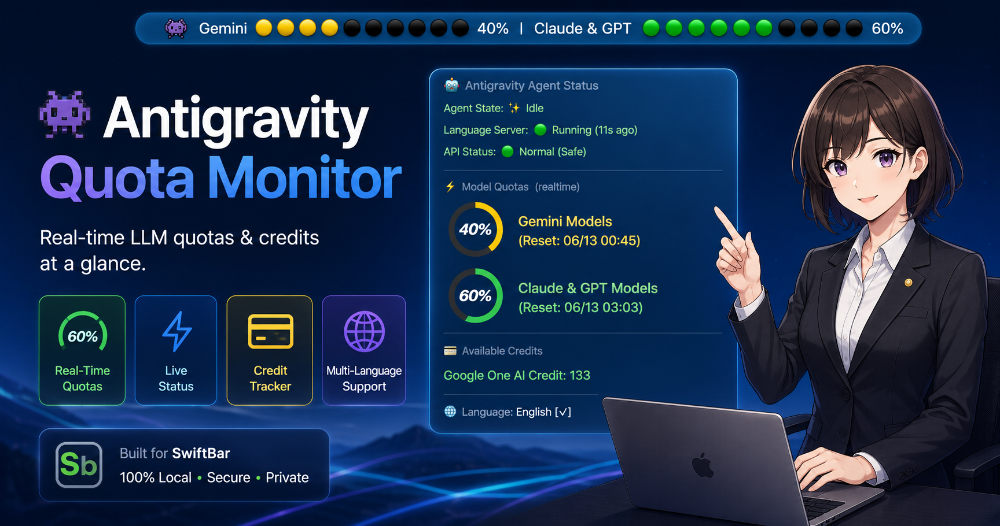

# 👾 Antigravity Quota Monitor (AQM)

**Antigravity Quota Monitor (AQM)** is a premium macOS menu bar utility (SwiftBar / xbar plugin) designed to monitor real-time API quotas, reset times, and monthly credits for your LLMs (Flash, Pro, Sonnet, Opus, etc.) under the Antigravity agent system.

With an ultra-fast, zero-ui-interference local API collector, it helps you keep track of your active model quotas without interrupting your workspace flow.

---

## ✨ Features

*   **📊 Real-Time Multi-Model Status Board**: Monitor current remaining percentage quotas for Flash (Med/High/Low), Pro (Low/High), Sonnet 4.6, Opus 4.6, and GPT-OSS 120B in a beautiful menu bar ribbon.
*   **🔌 Zero-Interference API Crawling**: Pure background fetching. No popup windows or browser session hijacking. It automatically hooks into your local Language Server daemon over localhost and fetches directly via the Connect protocol.
*   **💳 Monthly Credit Tracker**: Calculates your precise remaining Monthly Prompt Credits and Flow Credits, displaying them with status colors depending on usage (Green for safe, Yellow for warnings, Red for exhausted).
*   **⏱️ Smart UTC-to-Local Reset Times**: Detects the precise moment when your exhausted quota recovers and displays it translated to your local timezone.
*   **🌐 In-Menu Translation (EN / JA)**: Toggle display languages between English and Japanese with a single click.
*   **👾 Stealth & Pro Design**: Custom built-in interactive `About` section. The default debug menu items ("Run in Terminal", "Disable Plugin", standard About box) are hidden to keep the menu pristine. (Hold `Option (Alt)` while clicking to reveal them!).

---

## 🚀 Installation & Setup

Installation is highly streamlined. Please follow the steps below.

### 1. Install via VS Code Extension (Recommended)

The easiest way to get started is to install the bridge extension directly from your IDE's marketplace.

1. Open the **Extensions Panel** in your VS Code compatible IDE (VS Code, Cursor, etc.).
2. Search for **`AQM`** or `Antigravity Quota`.
3. Install **Antigravity Quota Monitor** published by **ma-do-ka**.

* 📦 *Open VSX: [ma-do-ka/antigravity-quota](https://open-vsx.org/extension/ma-do-ka/antigravity-quota)*
* 💻 *GitHub: [ma-do-ka/Antigravity-Quota-Monitor](https://github.com/ma-do-ka/Antigravity-Quota-Monitor)*

> [!NOTE]
> **SwiftBar Integration**
> Installing this IDE extension will automatically deploy the required SwiftBar plugin scripts to your macOS system in the background.  
> *Note: The SwiftBar application itself is not bundled. If it is not installed on your system, the extension will display a prompt with a direct link to download it.*

### 2. Prepare SwiftBar (macOS)

To display the monitor in your menu bar, you need the native macOS application **SwiftBar**.

1. Download and install the latest release from the [SwiftBar Official GitHub](https://github.com/swiftbar/SwiftBar) (or run `brew install swiftbar` if you use Homebrew).
2. Launch the SwiftBar app. It will automatically detect the AQM plugin deployed by the IDE and display your quotas in the menu bar!

---

## 🏗️ Technical Architecture

This plugin is optimized for high-performance, low-overhead execution:

*   **`antigravity_status.py`** (The Orchestrator): Parses local agent diagnostic logs, performs high-efficiency caching, manages localized menu renders, and acts as the SwiftBar entry point.
*   **`get_quota.js`** (The Connect Crawler): An ultra-fast script executing Node.js native sockets. It identifies the target Language Server PID via `/bin/ps`, scans target sockets restricted strictly to that PID, and securely makes direct HTTP POST calls to the Connect server in **under 0.04 seconds**.

---

## 🛡️ Privacy & Security

*   **No Third-Party Siphoning**: 100% of network traffic travels strictly over `127.0.0.1` (localhost). Your credentials never touch public endpoints or secondary logging systems.
*   **No Stored Keys**: The system utilizes temporary session tokens dynamically loaded from running daemons. There are no API keys saved in plaintext files.

---

## 🔄 Changelog

### 💎 V1.3.3 (May 27, 2026)
*   **Marketplace Metadata Optimization**: Fully refined package categories and search keywords (tags) for enhanced discoverability.
*   **Premium Visual Styling**: Implemented a dark theme gallery banner (`#0d1117`) for the Marketplace landing page, integrated direct sponsorship links via note, and clearly marked pricing as Free.
*   **Strict macOS Target Declaration**: Integrated native VS Code OS constraints using `"os": ["darwin"]` to explicitly mark the extension as macOS-only, seamlessly preventing installation confusion for Windows/Linux developers.

### 💎 V1.3.2 (May 26, 2026)
*   **Asset Refresh Integration**: Pushed all updated visual assets including `menu_screenshot.png` directly to the GitHub remote repository to solve registry-side relative path resolution and cache synchronization.

### 💎 V1.3.1 (May 26, 2026)
*   **Documentation Refinement**: Restored the main README content completely back to English as explicitly requested, ensuring standard global readability while preserving all features.

### 💎 V1.3.0 (May 26, 2026)
*   **Perfect Vertical Alignment**: Replaced standard list bullets with premium indentation and set dropdown monospace styling using `SFMono-Regular` alongside dynamic padding logic. Your model names now align perfectly like a pro.
*   **Smart UTC-to-Local Reset Times**: Streamlined quota recovery times by removing the redundant "year" label, adding a custom `⟳` prefix, and dynamically toggling between "Today" and "Tomorrow" formats depending on local times.
*   **Premium Cropped Neon Logo**: Restored the original high-tech dark metallic rounded rectangle background while cropping the glowing cyan neon quota circle and "AQM" typography right to the borders (margins-free) for a state-of-the-art tech icon.
*   **Extension Asset Packaging**: Bundled `banner.png` and `menu_screenshot.png` directly inside the packaged VSIX extension to fully bypass strict Content Security Policy (CSP) blocking inside VS Code.

---

## 📄 License

This project is licensed under the **Apache License 2.0**.
Copyright 2026 Madoka (US Stock Journal Editorial Director)

---

*🇯🇵 For Japanese Users: 詳細な使い方やセットアップガイドについては、[こちらの公式Note記事](https://note.com/us_kabu_journal/n/nb99ef3e525ce) をご覧ください。*
