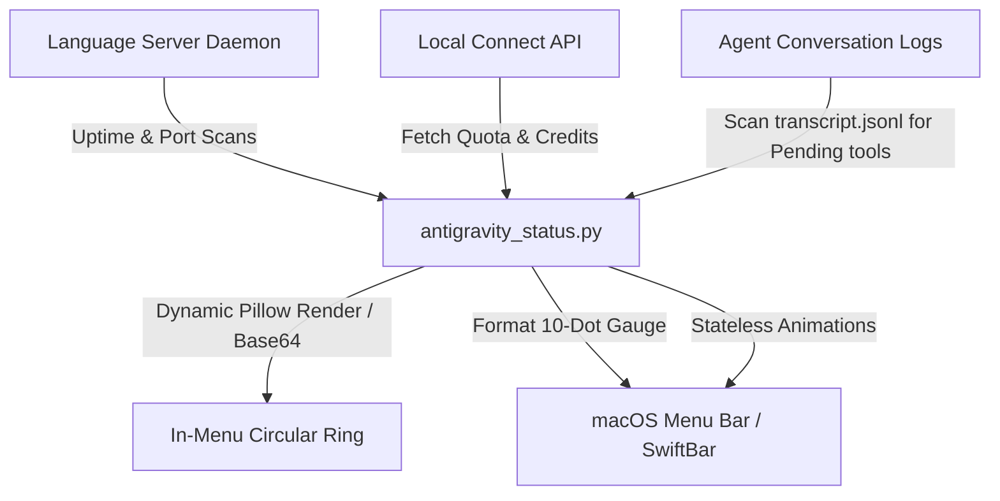
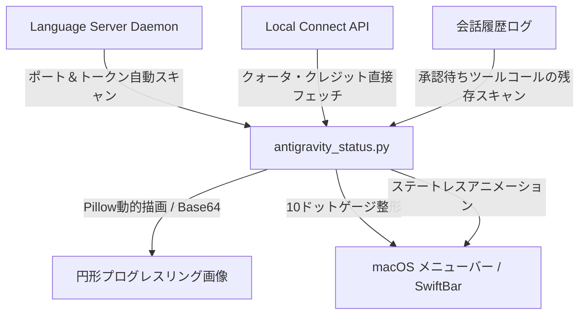

# 👾 Antigravity Quota Monitor (AQM)

🇯🇵 **[日本語バージョンはこちら (Jump to Japanese Version)](#-日本語バージョン)**

---

**Antigravity Quota Monitor (AQM)** is a premium macOS menu bar utility (SwiftBar / xbar plugin) designed to monitor real-time API quotas, reset times, and monthly credits for your LLMs under the Antigravity agent system.

Starting with **v2.0.0**, AQM has been completely redesigned with an ultra-sleek **10-Dot System Bar Gauge** and **Dynamic In-Menu Progress Rings** to offer a premium, space-saving desktop dashboard experience.

---

## ✨ Features (v2.0.0)

*   **🟢 10-Dot System Bar Gauge (New)**: Replaced verbose textual status items on your menu bar with a beautiful, space-efficient horizontal 10-dot gauge (`🔴🟢🔵🟣🟡🟠`). You can grasp your exact quota level (in 10% steps) at a single glance.
*   **🍩 Dynamic In-Menu Progress Rings (New)**: Detailed dropdown now generates high-definition circular progress rings dynamically on-the-fly using `Pillow`. 
*   **🛡️ Non-Disruptive Text Fallback (New)**: Zero dependencies by default. If `Pillow` is not installed on the system, the script seamlessly falls back to beautiful text-based block indicators (`████░░`) to guarantee zero-crash execution.
*   **⚠️ Advanced Agent State Sync (New)**: Fixed state synchronization. The menu bar icon dynamically animates to reflect the AI agent's current state: Thinking (✨🤔), Awaiting Your Input/Approval (⚠️ Pending!), Idle (👾), or Offline (⚪️). It now precisely tracks tool approvals (e.g., `run_command`, `write_to_file`) to show warning states instantly.
*   **💳 Clean Credit Tracker**: Automatically consolidates credit logs to show remaining `Google One AI Credits` clearly, omitting redundant details to maximize readability.
*   **⏱️ Localized Reset Times**: Detects the precise UTC reset times from local APIs and automatically translates them into your local timezone (e.g. `JST`). Displays `-` when quota is fully available (100%) to reduce noise.
*   **🌐 In-Menu Translation (EN / JA)**: Toggle display languages between English and Japanese with a single click in the menu dropdown.
*   **🐍 Pure Python / Zero External Dependencies**: The entire daemon runs on Python standard library only. **No Node.js, no npm, no external runtimes required.**

---

## 🏗️ Technical Architecture

AQM uses a light-weight, asynchronous pipeline designed for zero-configuration, zero-dependency, and extremely low system load.

---

## 🔴 Quota Status System

AQM represents remaining quotas using a premium color-coded system.

| Status | Dot Color | Percentage Range | Visual Representation & Meaning |
| :---: | :--- | :---: | :--- |
| 🟣 | **Purple** | `100%` | **Full capacity** — Completely safe and ready to generate content. |
| 🔵 | **Blue** | `80% - 99%` | **Highly stable** — Securely active with plenty of quota remaining. |
| 🟢 | **Green** | `60% - 79%` | **Safe state** — Normal operation mode with stable capacity. |
| 🟡 | **Yellow** | `40% - 59%` | **Caution mode** — Approaching limits. Displays the reset timer (e.g., `⟳ JST 15:16`). |
| 🟠 | **Orange** | `20% - 39%` | **Low capacity** — Quota running thin. Recovery timer displayed. |
| 🔴 | **Red** | `0% - 19%` | **Exhausted** — Crucial recovery state. Reset time is highlighted. |

---

## 🧠 Agent State Indicator

The leftmost icon in the menu bar dynamically reflects your AI agent's real-time operational state:

| State | Animation | Description |
| :---: | :--- | :--- |
| **Thinking** | ✨️🤔 → 💫🤔 → ⭐🤔 → 🌟😃 | Agent is actively generating, analyzing, or executing tasks. |
| **Pending** | ⚠️ Pending! (Awaiting Approval) | Agent is waiting for your permission or input (e.g. `run_command`, `write_to_file`). |
| **Idle** | 👾 | Agent is standing by. No active tasks. |
| **Offline** | ⚪️ | Language Server is not running. |

---

## 🚀 Installation & Setup

### 1. Install via VS Code Extension (Recommended)

1. Open the **Extensions Panel** in your IDE (VS Code, Cursor, etc.).
2. Search for **`AQM`** or `Antigravity Quota`.
3. Install **Antigravity Quota Monitor** published by **ma-do-ka**.

* 📦 *Open VSX: [ma-do-ka/antigravity-quota](https://open-vsx.org/extension/ma-do-ka/antigravity-quota)*
* 💻 *GitHub: [ma-do-ka/Antigravity-Quota-Monitor](https://github.com/ma-do-ka/Antigravity-Quota-Monitor)*

> [!NOTE]
> Installing this extension automatically deploys the latest SwiftBar plugin scripts to your macOS environment in the background.

### 2. Prepare SwiftBar (macOS)

1. Download and install **SwiftBar** from the [SwiftBar Official GitHub](https://github.com/swiftbar/SwiftBar) (or run `brew install swiftbar` via Homebrew).
2. Launch SwiftBar. It will automatically detect the AQM script and load it.

---

## 🛡️ Privacy & Security

*   **100% Local Communications**: All API queries travel strictly over `127.0.0.1` (localhost). Your credentials never touch any public servers or third-party metrics platforms.
*   **Dynamic Session Binding**: AQM retrieves temporary authorization tokens from local running daemons. No plaintext API keys are ever stored on disk.

---

## 📋 Changelog

### v2.0.1
- 🚀 **Automated Publishing via GitHub Actions**: Directly publish compiled packages to Open VSX Registry and VS Code Marketplace upon pushing to `main` (if secrets are set).
- ⚙️ **Modernized CI Workflow**: Upgraded deprecated GitHub Actions syntax.

### v2.0.0
- ✨ **10-Dot System Bar Gauge**: Clean, space-saving dot indicator array replacing verbose textual titles.
- ✨ **Pillow Dynamic Ring Drawing**: Generates high-definition circular progress rings inside the dropdown.
- ✨ **Robust Text-based Fallback**: Seamlessly falls back to `████░░` if Pillow is missing.
- 🐛 **Advanced Tool Approval Sync**: Fixed a state-tracking bug where user Proceed approvals for tools (`run_command` / file edits) were not reflected in the status icon.

### v1.7.0
- 🚀 Bulletproof scan-and-clean to prevent duplicate icons upon version updates.
- 🐛 Fixed permanent "Awaiting Input" state hanging.

### v1.5.0
- 🚀 Pure Python Migration. Removed Node.js (`get_quota.js`) dependency.

---

# 🇯🇵 日本語バージョン

**Antigravity Quota Monitor (AQM)** は、macOS のメニューバー（システムバー）および VS Code に、Antigravity（Gemini）エージェント環境下の利用クォータ残量、リセット時間、およびクレジット制限枠を**美しく可視化するプレミアムユーティリティ**です。

メジャーアップデートである **v2.0.0** では、デスクトップ領域を邪魔しない**10ドット・システムバーゲージ**と、詳細メニュー内の**動的プログレスリング画像表示**を新たに搭載し、圧倒的にスマートなUIへ進化しました。

---

## ✨ v2.0.0 の新機能と特長

*   **🟢 10ドット・システムバーゲージ (New)**: メニューバー上の長ったらしい文字列表示を廃止し、省スペースで直感的な10個のカラードット（`🔴🟢🔵🟣🟡🟠`）によるゲージ表示に変更。残りクォータを10%刻みで直感的に把握できます。
*   **🍩 動的プログレスリング画像表示 (New)**: 詳細ドロップダウン内に、`Pillow` ライブラリを用いてその場で高解像度な円形進捗リング画像を動的に生成して表示します。
*   **🛡️ 依存ゼロの自動テキストフォールバック (New)**: 万が一システムに `Pillow` がインストールされていない環境であっても、プログラムがクラッシュすることなく自動的にテキストブロックバー（`████░░`）へ安全に切り替える堅牢なフォールバック設計を導入。
*   **⚠️ 高度な承認待ち状態の検知 (New)**: ユーザーの承認（Proceed）を待つコマンド実行（`run_command`）やファイル書き込み（`write_to_file` / `replace_file_content`）のログ状態をリアルタイムにスキャン。確認待ち状態を正確に捉え、メニューバー上に `⚠️ Pending!`（待機中）アイコンをアニメーション表示します。
*   **💳 クレジット表示のシンプル化**: 重複するプロンプト/フロークレジット制限表示を整理し、`Google One AI Credit` に統合されたスマートな表示レイアウトに変更。
*   **⏱️ 回復時間の日本時間自動変換**: APIが返すUTC時間のリセットタイミングを自動的に日本時間（JST）へ変換。残量が 100% 満タンの際は回復時間を `-` と表示し、無駄な表示ノイズを極限まで排除。
*   **🌐 日英ワンクリック切り替え**: ドロップダウンメニュー内から、英語表示と日本語表示をワンクリックで瞬時に切り替え可能。
*   **🐍 Pure Python / 外部依存なし**: バックエンド全体が Python 標準ライブラリ（`urllib`）のみで動作。Node.js や npm 等のインストールは一切必要ありません。

---

## 🏗️ 技術アーキテクチャ

AQM は、ローカル環境への負荷と外部依存をゼロに抑えるために、完全な Pure Python 非同期パイプラインで構築されています。

---

## 🔴 クォータ表示ステータス一覧

メニューバー上の各モデルの残りクォータは、プレミアムな6色のカラーコードシステムによって視覚的に美しく分類されます。

| 状態 | ドット色 | パーセント閾値 | 視覚表現とステータスの意味 |
| :---: | :--- | :---: | :--- |
| 🟣 | **紫 (Purple)** | `100%` | **満タン稼働中** — クォータは完全に安全で、すぐにフル生成が可能です。 |
| 🔵 | **青 (Blue)** | `80% - 99%` | **極めて安定** — 十分な容量を維持して安全に稼働中。 |
| 🟢 | **緑 (Green)** | `60% - 79%` | **通常動作状態** — 安定した残量があり、平常通り生成可能です。 |
| 🟡 | **黄 (Yellow)** | `40% - 59%` | **注意モード** — 残量がやや低下。回復時間が動的に表示されます（例: `⟳ JST 15:16`）。 |
| 🟠 | **橙 (Orange)** | `20% - 39%` | **残量僅少** — 回復時間（日本時間 JST）を表示。生成を抑えて回復を待つことを推奨。 |
| 🔴 | **赤 (Red)** | `0% - 19%` | **制限・枯渇** — API制限回復待ち。回復タイムスタンプを表示。 |

---

## 🧠 エージェント状態インジケーター

メニューバー左端のアイコンが、AIエージェントのリアルタイムな動作状態に応じてアニメーションで動的に変化します：

| 状態 | アニメーション | 説明 |
| :---: | :--- | :--- |
| **思考中** | ✨️🤔 → 💫🤔 → ⭐🤔 → 🌟😃 | エージェントがコード生成・分析・タスク実行中 |
| **承認待ち** | ⚠️ Pending! (承認・入力待ち) | `run_command` や `write_to_file` 等の実行許可ダイアログが表示され、ユーザーの入力を待機している状態 |
| **待機中** | 👾 | アイドル状態。アクティブなタスクなし |
| **オフライン** | ⚪️ | Language Server が停止中 |

---

## 🚀 導入・セットアップ手順

### 1. VS Code 拡張機能のインストール（推奨）

1. お使いのIDE（VS Code, Cursorなど）の **拡張機能パネル**（Extensions）を開きます。
2. 検索バーに **`AQM`** または `Antigravity Quota` と入力します。
3. **ma-do-ka** がパブリッシュしている **Antigravity Quota Monitor (AQM)** をインストールします。

* 📦 *Open VSX 公式: [ma-do-ka/antigravity-quota](https://open-vsx.org/extension/ma-do-ka/antigravity-quota)*
* 💻 *GitHub: [ma-do-ka/Antigravity-Quota-Monitor](https://github.com/ma-do-ka/Antigravity-Quota-Monitor)*

> [!NOTE]
> 拡張機能がインストールされると、バックグラウンドで自動的に最新の SwiftBar プラグインスクリプトが macOS の適切な場所に配置されます。

### 2. SwiftBar の準備 (macOS)

1. [SwiftBar 公式 GitHub](https://github.com/swiftbar/SwiftBar) からアプリをダウンロードしてインストールします（Homebrew ユーザーは `brew install swiftbar` でも可）。
2. SwiftBar を起動します。自動的に AQM プラグインが読み込まれ、メニューバーに表示が開始されます。

---

## 🛡️ プライバシーとセキュリティ

*   **完全ローカル通信**: APIクエリを含むすべての通信はローカルホスト（`127.0.0.1`）でのみ完結します。クォータ情報や認証トークンが外部サーバーへ送信されることは一切ありません。
*   **セッショントークンの動的ロード**: 起動中の LSP プロセスから一時的なトークンを動的に取得するため、APIキー等の秘密情報をハードコードして保存するリスクがありません。

---

## 📋 更新履歴 (Changelog)

### v2.0.1
- 🚀 **GitHub Actions による自動パブリッシュ**: `main` ブランチへのプッシュ時に、VS Code Marketplace および Open VSX Registry へ自動かつ即座に拡張機能をパブリッシュする仕組みを追加（シークレット設定時）。
- ⚙️ **CI ワークフローの近代化**: 非推奨となっていた GitHub Actions 構文（set-output 等）を最新の方式へアップデート。

### v2.0.0
- ✨ **10ドット・システムバーゲージ**: 冗長なテキストを廃止し、省スペースで直感的なドット配列UIへ刷新。
- ✨ **Pillow動的円形リング描画**: プルダウン内に高解像度な円形の進捗リングを表示する機能を統合。
- ✨ **テキスト自動フォールバック機能**: Pillow未インストール時は自動的に `████░░` テキストゲージへ退避し、クラッシュを防止。
- 🐛 **高度な承認待ち連携**: ユーザー承認を待つ各種コマンドやファイル操作がメニューバー上の `⚠️` アイコンと正確に連動するよう改善。

### v1.7.0
- 🚀 バージョンアップデート時の二重起動防止スクリプトを導入。

---

### 🌟 Support the Project / プロジェクト支援のお願い
If you find this project helpful, please consider giving it a ⭐ on [GitHub](https://github.com/ma-do-ka/Antigravity-Quota-Monitor)! Your support keeps the development active and motivated.

もしこのプロジェクトが役に立ったと感じられたら、ぜひ [GitHub](https://github.com/ma-do-ka/Antigravity-Quota-Monitor) で ⭐ (Star) を押していただけると嬉しいです！皆様の支援が開発の大きなモチベーションになります。
